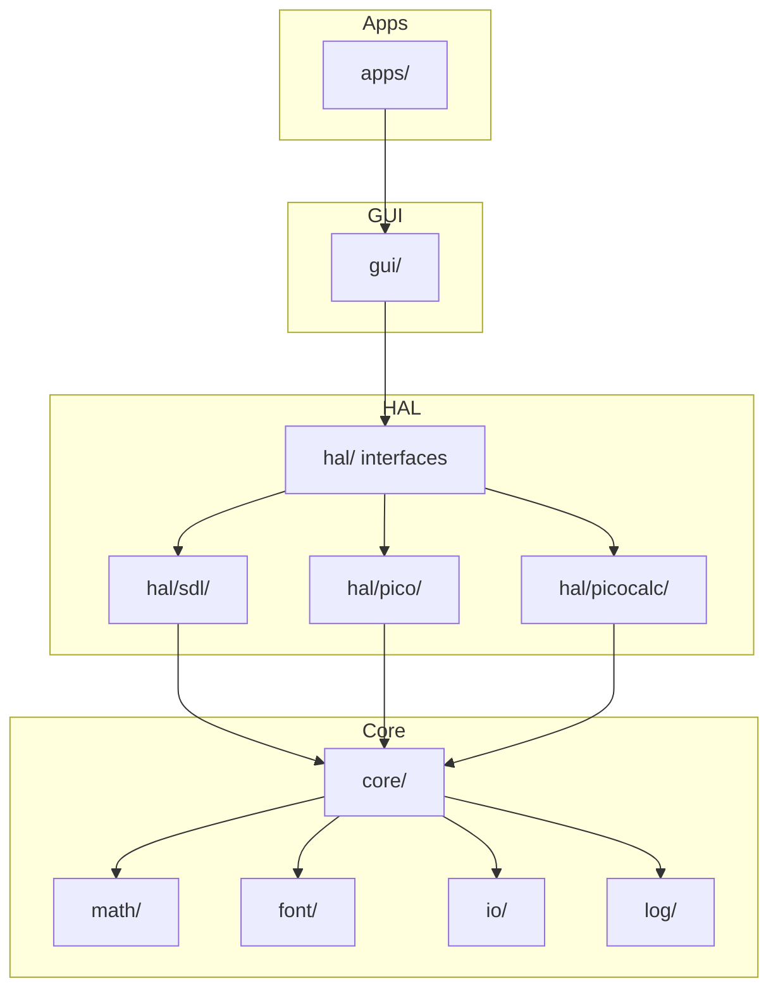

# Architecture

This document describes the software architecture for the kbd_calc project.

## Source Layout

```
src/overboard/
├── core/        — portable keyboard types, no platform headers
├── math/        — portable calculator engine, no UI dependencies
├── font/        — font metrics for math typesetting
├── io/          — VIA/JSON keymap loading
├── log/         — lightweight logging
├── gui/         — LVGL widget management (platform-agnostic)
├── hal/         — hardware abstraction interfaces + platform drivers
│   ├── sdl/     — SDL desktop simulator
│   ├── pico/    — RP2350 stub (minimal)
│   └── picocalc/ — ClockworkPi PicoCalc (ILI9488 + I2C keyboard)
└── apps/        — application entry points
```

---

## Layer Overview



---

## Module Descriptions

### `core/` — Portable keyboard logic
No platform headers allowed.

| Class | Responsibility |
|-------|---------------|
| `Grid_Layout` / `Keyboard_Layout` | Key grid geometry and span definitions |
| `Keymap` | Key-code to character/function mapping |
| `Layer_Manager` | Active layer state and switching |
| `Config` | Runtime configuration loading |
| `Point`, `Rect` | Shared geometry types |

### `math/` — Portable calculator engine
No UI or platform dependencies. Fully unit-testable in isolation.

| Class | Responsibility |
|-------|---------------|
| `Calc_Engine` | Evaluates expressions, manages history and state |
| `Parser` | Tokenises and parses expression strings into an AST |
| `layout/Layout_Engine` | Converts AST to typeset layout boxes for rendering |

### `font/` — Font metrics
Provides character size data consumed by `layout/Layout_Engine`.

### `io/` — Keymap loading
Parses VIA-format JSON layouts and scancode mapping files.

### `log/` — Logging
Lightweight `Stdout_Logger` with log-level filtering.

### `gui/` — LVGL widget management
Platform-agnostic. Depends on `hal/` interfaces and `core/`/`math/` but **never** on `hal/sdl/` or `hal/kn34/`.

| File | Responsibility |
|------|---------------|
| `App_View` | Root GUI object; owns `LCD_Section` + `Keyboard_View`; implements `I_Display` |
| `LCD_Section` | Bezel, history table, and typeset math preview canvas (top 500 px) |
| `Keyboard_View` | LVGL button grid matching physical key layout (bottom 300 px) |
| `math_canvas` | Standalone utility: renders a typeset expression onto an `lv_canvas` |
| `lvgl_theme.hpp` | Centralised color constants and `lvgl_color()` helper |

### `hal/` — Hardware abstraction interfaces

| File | Responsibility |
|------|---------------|
| `I_App` | Lifecycle interface: `init`, `run`, `should_quit`, `get_display` |
| `I_Display` | Display contract: `refresh`, `update_layer`, `render` |
| `I_Input` | Input polling interface |
| `display_config.hpp` | Shared dimension constants (`FULL_*`, `LCD_*`, `KBD_*`) |
| `App_Factory` | Constructs the correct `I_App` for the active compile target |

### `hal/sdl/` — SDL desktop simulator

| Class | Responsibility |
|-------|---------------|
| `Display` | Owns the SDL window and LVGL display handle; exposes `screen()` for GUI attachment |
| `SDL_App` | SDL lifecycle + event loop; owns both `Display` (HAL) and `App_View` (GUI) |
| `SDL_Input` | SDL event pump → `Key_Event` queue |
| `SDL_Keymap` | Maps SDL scancodes to calculator key indices |

### `hal/pico/` — RP2350 embedded target
Stub implementations of `I_App`, `I_Display`, and `I_Input`. Pending hardware bring-up.

---

## Dependency Rules

| Layer | May depend on | Must NOT depend on |
|-------|---------------|--------------------|
| `core/`, `math/`, `font/` | each other | `hal/`, `gui/`, platform headers |
| `hal/` interfaces | `core/` | `gui/`, platform headers |
| `hal/sdl/`, `hal/picocalc/` | `hal/` interfaces, `core/`, `gui/` | each other |
| `gui/` | `hal/` interfaces, `core/`, `math/` | `hal/sdl/`, `hal/picocalc/` |
| `apps/` | everything | — |

**Key invariant**: `gui/` has no dependency on any specific HAL implementation. The SDL window driver exposes `lv_obj_t* screen()` as the single coupling point — `App_View` uses it to attach LVGL widgets without knowing anything about SDL.

---

## Display Architecture

The physical display is a single unified unit (400 × 800 px) driven entirely by LVGL:

```
┌──────────────────────┐  ← LCD_Section  (400 × 500 px)
│  Bezel               │    history table + typeset math preview
│  ┌────────────────┐  │
│  │ History Table  │  │    lv_table — expression/result pairs
│  ├────────────────┤  │
│  │ Math Preview   │  │    lv_canvas — typeset via Layout_Engine
│  └────────────────┘  │
├──────────────────────┤  ← Keyboard_View (400 × 300 px)
│  Layer header        │    lv_label — current layer name
│  [  7 ][  8 ][  9 ] │
│  [  4 ][  5 ][  6 ] │    lv_button + lv_label per key
│  [  1 ][  2 ][  3 ] │
│  [  0 ][ .  ][ =  ] │
└──────────────────────┘
```

`hal/sdl/Display` creates the SDL window and LVGL display handle, then calls `lv_timer_handler()` once. `App_View` is then constructed on the returned `screen()` root, attaching the two LVGL container objects at fixed vertical offsets.

---

## SDL Keyboard Mapping

Physical keyboard input is mapped to calculator keys via `SDL_Keymap`:

| Physical Key | Calculator function |
|--------------|---------------------|
| `q` `w` `e` / `a` `s` `d` / `z` `x` `c` | Key grid rows 1–3 |
| `0`–`9` | Digit keys |
| `Return` | Equals |
| `Backspace` | Backspace |
| `Escape` | All Clear |
| Arrow keys | Cursor / layer navigation |

Scancode bindings are loaded at startup from VIA-format JSON via `io/via_layout`.

---

## Build System

- **CMake 4.0+**, build script at `scripts/build.sh`
- Hardware-specific source lists live under `data/hardware/<target>/CMakeLists.txt`

| Target | Binary | Description |
|--------|--------|-------------|
| `TARGET_SDL` | `calc_sim` | SDL desktop simulator (default) |
| `TARGET_RP2350` | `calc_firmware` | RP2350 embedded firmware (Pico) |

---

## Platform Support

### SDL Simulator
Desktop development and testing. Uses SDL2 + LVGL SDL driver. Activated with `-DTARGET=sdl`.

### ClockworkPi PicoCalc (RP2040/RP2350)
Self-contained calculator with ILI9488 320×320 SPI display and STM32-driven I2C keyboard. HAL implemented in `hal/picocalc/`. Activated with `-DTARGET=rp2350`.

### Raspberry Pi Pico (RP2350)
Custom calculator hardware with integrated display. Embedded target. Activated with `-DTARGET=rp2350`. HAL implementation is a stub pending hardware bring-up.
