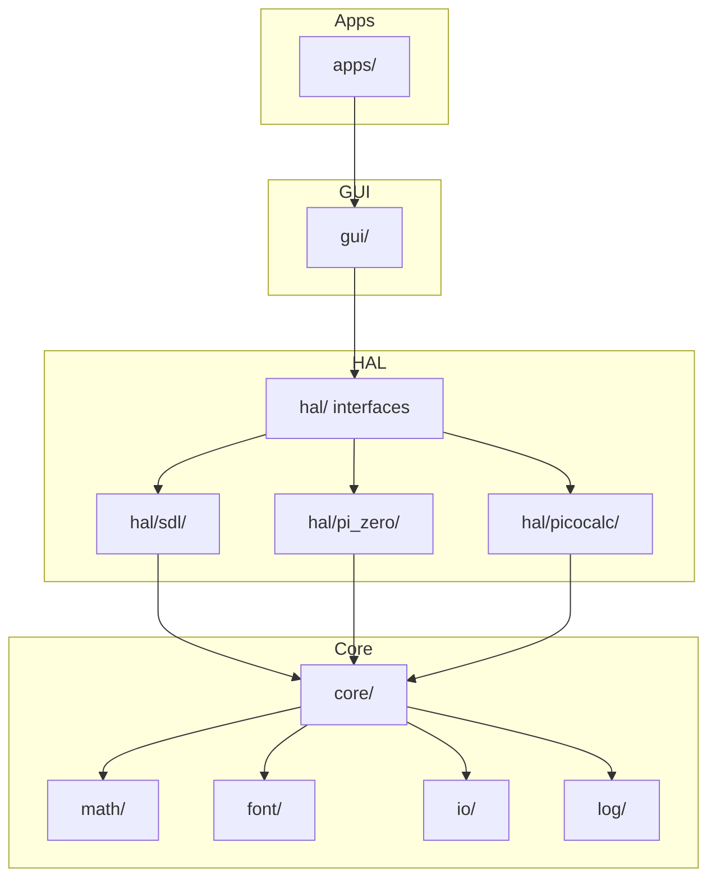

# Architecture

This document describes the software architecture for the kbd_calc project.

## Source Layout

```
src/overboard/
├── core/        — portable keyboard types, no platform headers
├── math/        — portable calculator engine, no UI dependencies
├── font/        — font metrics for math typesetting
├── io/          — VIA/JSON keymap loading
├── log/         — lightweight logging
├── gui/         — LVGL widget management (platform-agnostic)
├── hal/         — hardware abstraction interfaces + platform drivers
│   ├── sdl/     — SDL desktop simulator
│   ├── pi_zero/ — Raspberry Pi Zero (DRM/KMS display + Linux input)
│   └── picocalc/ — ClockworkPi PicoCalc (ILI9488 + I2C keyboard)
└── apps/        — application entry points
```

---

## Layer Overview



---

## Module Descriptions

### `core/` — Portable keyboard logic
No platform headers allowed.

| Class | Responsibility |
|-------|---------------|
| `Grid_Layout` / `Keyboard_Layout` | Key grid geometry and span definitions |
| `Keymap` | Key-code to character/function mapping; loads from VIA JSON |
| `Layer_Manager` | Active layer state and switching; provides `action_at()` and `label_at()` for virtual keyboard |
| `Action_Code` | Semantic calculator operations (DIGIT_0-9, ADD, EVAL, etc.) |
| `Input_Key` | Physical keyboard key enumeration (KEY_0-9, F1-F24, NUMPAD_*, arrows, etc.) |
| `Config` | Runtime configuration loading |
| `Point`, `Rect` | Shared geometry types |

### `math/` — Portable calculator engine
No UI or platform dependencies. Fully unit-testable in isolation.

| Class | Responsibility |
|-------|---------------|
| `Calc_Engine` | Evaluates expressions, manages history and state |
| `Parser` | Tokenises and parses expression strings into an AST |
| `layout/Layout_Engine` | Converts AST to typeset layout boxes for rendering |

### `font/` — Font metrics
Provides character size data consumed by `layout/Layout_Engine`.

### `io/` — Keymap loading
Parses VIA-format JSON layouts and scancode mapping files.

### `log/` — Logging
Lightweight `Stdout_Logger` with log-level filtering.

### `gui/` — LVGL widget management
Platform-agnostic. Depends on `hal/` interfaces and `core/`/`math/` but **never** on any specific HAL implementation (`hal/sdl/`, `hal/pi_zero/`, `hal/picocalc/`).

| File | Responsibility |
|------|---------------|
| `App_View` | Root GUI object; owns `LCD_Section` + `Keyboard_Display`; implements `I_Display`; routes input events |
| `Panel_Manager` | Manages panel stack (Calculator, Menu, Status, etc.); routes `handle_text()`, `handle_input()`, `handle_input_key()` |
| `Calculator_App` | Main calculator panel; converts text → Action_Code; manages calc engine and LCD section |
| `App_Menu` | Application launcher menu; handles text shortcuts ('c' for calculator) |
| `Status_Page` | System status display (uptime, memory, build info) |
| `Key_Mapping_Info` | Keyboard layout visualization panel |
| `LCD_Section` | Bezel, history table, and typeset math preview canvas (top 500 px) |
| `Keyboard_Display` | LVGL button grid matching physical key layout (bottom 300 px); displays layer labels |
| `math_canvas` | Standalone utility: renders a typeset expression onto an `lv_canvas` |
| `lvgl_theme.hpp` | Centralised color constants and `lvgl_color()` helper |
| `lv_font_superscript.c` | Custom LVGL font with superscript glyphs (², ³, ⁿ) for power buttons |
| Popups | F1/F2 function key popup menus (trig, constants, etc.) |

See [Custom Fonts](custom_fonts.md) for font generation details.

### `hal/` — Hardware abstraction interfaces

| File | Responsibility |
|------|---------------|
| `I_App` | Lifecycle interface: `init`, `run`, `should_quit`, `get_display` |
| `I_Display` | Display contract: `refresh`, `update_layer`, `render` |
| `I_Input` | Input polling interface |
| `display_config.hpp` | Shared dimension constants (`FULL_*`, `LCD_*`, `KBD_*`) |
| `App_Factory` | Constructs the correct `I_App` for the active compile target |

### `hal/sdl/` — SDL desktop simulator

| Class | Responsibility |
|-------|---------------|
| `Display` | Owns the SDL window and LVGL display handle; exposes `screen()` for GUI attachment |
| `SDL_App` | SDL lifecycle + event loop; owns both `Display` (HAL) and `App_View` (GUI); routes input events |
| `SDL_Input` | Event pump and filtering; converts platform keyboard/mouse events → `Key_Event` queue |
| `event_filter()` | Implements text-first routing strategy for keyboard events (see Input Architecture below) |

### `hal/pi_zero/` — Raspberry Pi Zero target
Linux DRM/KMS display driver (`Display_DRM`), Linux evdev input handler (`Linux_Input`), and the main `PiZero_App` lifecycle class.

---

## Dependency Rules

| Layer | May depend on | Must NOT depend on |
|-------|---------------|--------------------|
| `core/`, `math/`, `font/` | each other | `hal/`, `gui/`, platform headers |
| `hal/` interfaces | `core/` | `gui/`, platform headers |
| `hal/sdl/`, `hal/pi_zero/`, `hal/picocalc/` | `hal/` interfaces, `core/`, `gui/` | each other |
| `gui/` | `hal/` interfaces, `core/`, `math/` | `hal/sdl/`, `hal/pi_zero/`, `hal/picocalc/` |
| `apps/` | everything | — |

**Key invariant**: `gui/` has no dependency on any specific HAL implementation. The SDL window driver exposes `lv_obj_t* screen()` as the single coupling point — `App_View` uses it to attach LVGL widgets without knowing anything about SDL.

---

## Display Architecture

The physical display is a single unified unit (400 × 800 px) driven entirely by LVGL:

```
┌──────────────────────┐  ← LCD_Section  (400 × 500 px)
│  Bezel               │    history table + typeset math preview
│  ┌────────────────┐  │
│  │ History Table  │  │    lv_table — expression/result pairs
│  ├────────────────┤  │
│  │ Math Preview   │  │    lv_canvas — typeset via Layout_Engine
│  └────────────────┘  │
├──────────────────────┤  ← Keyboard_View (400 × 300 px)
│  Layer header        │    lv_label — current layer name
│  [  7 ][  8 ][  9 ] │
│  [  4 ][  5 ][  6 ] │    lv_button + lv_label per key
│  [  1 ][  2 ][  3 ] │
│  [  0 ][ .  ][ =  ] │
└──────────────────────┘
```

`hal/sdl/Display` creates the SDL window and LVGL display handle, then calls `lv_timer_handler()` once. `App_View` is then constructed on the returned `screen()` root, attaching the two LVGL container objects at fixed vertical offsets.

---

## Input Architecture (Text-First)

The calculator implements a **unified text-first input architecture** where all printable characters flow through a common `handle_text()` path, ensuring consistent behavior across all input sources.

### Three Input Sources

All three converge at `handle_text(char32_t)`:

1. **Physical Keyboard** (top row 0-9, letters, operators)
   - Platform/OS generates text event → UTF-32 codepoint
   - HAL routes to `handle_text()`

2. **Physical Numpad** (NumPad 0-9, +, -, *, /)
   - Platform/OS generates text event → UTF-32 codepoint
   - HAL routes to `handle_text()`

3. **Virtual Keyboard** (on-screen LVGL buttons)
   - Button click → read label from layer
   - Single-char labels ("4", "+") → convert to UTF-32 → `handle_text()`
   - Multi-char labels ("Esc", "Sin") → use Action_Code → `handle_input()`

### HAL Input Routing Strategy

Each HAL implementation must route physical input events into one of three event types:

**Path 1: Mapped Macropad Keys**
- **Trigger:** Physical key has explicit `input_key` mapping in keyboard.json
- **Generate:** `Action` event with `key_index`
- **Text generation:** Block/suppress—key is fully handled by layer mapping
- **Use case:** Custom macropad layouts using F13-F24 or other dedicated keys

**Path 2a: Printable Keys**
- **Trigger:** Physical key that produces printable characters (digits, letters, operators)
- **Generate:** Both `Direct_Action` (Input_Key) AND `Text` (UTF-32 codepoint)
- **Text generation:** Enable—allow OS/platform to generate text event
- **Result:** Two events processed:
  1. Direct_Action for context (key identity)
  2. Text for actual character input

**Path 2b: Non-Printable Keys**
- **Trigger:** Navigation keys (arrows, F1-F12, ESC, etc.)
- **Generate:** `Direct_Action` event with `Input_Key`
- **Text generation:** Block/suppress—no text representation exists
- **Result:** Only Direct_Action event

### Platform-Specific Considerations

Different platforms handle text generation differently:

**Desktop Systems (SDL, X11, Win32):**
- OS provides text input API (SDL_TEXTINPUT, WM_CHAR, etc.)
- Printable keys must allow OS to complete text processing
- HAL converts platform text events to UTF-32 `Text` events

**Embedded Systems (evdev, I2C keyboards):**
- HAL generates text directly from key codes
- Consult character mapping tables (keyboard layout)
- Convert to UTF-32 and generate `Text` events

**Critical:** Printable keys on numpad/keyboard MUST generate text events consistently, regardless of physical key location or input method.

### Text → Action Conversion

`Calculator_App::handle_text()` converts UTF-32 text to semantic actions:

```cpp
switch (codepoint) {
    case U'4': action = Action_Code::DIGIT_4; break;
    case U'+': action = Action_Code::ADD; break;
    case U'.': action = Action_Code::DECIMAL; break;
    // ...
}
m_impl->engine.handle_key(action);  // Engine uses Action_Code
refresh();
return true;  // Text consumed, refresh done
```

This keeps the calculator engine (`math/`) independent of text encoding.

### Key Types

- **Input_Key**: Physical keys (KEY_4, NUMPAD_4, F1, ARROW_LEFT)
- **Action_Code**: Semantic operations (DIGIT_4, ADD, EVAL, CLEAR)
- **Text**: UTF-32 printable characters ('4', '+', '.')

**Flow:** Physical key → Input_Key → Text → Action_Code → Engine

### Virtual Keyboard Label Emission

`keyboard.json` structure:
```json
{
    "17": {
        "position": {"x": 3.25, "y": 2.25, "w": 1, "h": 1}
    },
    "layers": [{
        "name": "Basic",
        "keys": {
            "17": {"code": "DIGIT_7", "label": "7"}
        }
    }]
}
```

- **position**: Physical layout for button placement
- **label**: Text shown on button; single-char labels emit as text
- **code**: Action fallback for multi-char labels
- **input_key**: Optional—only for custom macropad keys (F13-F24)

### Benefits

✅ Consistency across all input sources  
✅ OS handles keyboard layouts/localization  
✅ Single text handling path  
✅ Hardware macropads work seamlessly (VIA configuration)  
✅ No double-refresh (panels signal when they've refreshed)  

---

## VIA Macropad Configuration

For physical hardware macropads configured via VIA/QMK firmware:

### Function Keys for Special Functions

Use **F13-F24** for unique macropad functions that don't exist on standard keyboards:

| HID Code | Key | Recommended Use |
|----------|-----|-----------------|
| 0x68 | F13 | Layer switch / special mode |
| 0x69 | F14 | Clear / All Clear |
| 0x6A | F15 | Backspace / Delete |
| 0x6B | F16 | Memory functions |
| 0x6C | F17 | Scientific functions |
| 0x6D-0x73 | F18-F24 | Custom functions (7+ keys available) |

**Total available:** 12 unique function keys (F13-F24) for 35+ key macropads

### Standard Keys for Digits/Operators

Use **standard NumPad keys** for printable characters—they naturally generate text:

| Key | Generates | Handled as |
|-----|-----------|-----------|
| NumPad 0-9 | Text '0'-'9' | DIGIT_0-9 actions |
| NumPad + | Text '+' | ADD action |
| NumPad - | Text '-' | SUBTRACT action |
| NumPad * | Text '*' | MULTIPLY action |
| NumPad / | Text '/' | DIVIDE action |
| NumPad . | Text '.' | DECIMAL action |
| NumPad Enter | Input_Key | EVAL action (non-printable) |

### Example 34-Key Layout

```
F13   F14   F15   F16     ← Special functions (ESC, Clear, etc.)
 7     8     9     /       ← NumPad keys (generate text)
 4     5     6     *
 1     2     3     -
 0     .   Enter   +
```

**VIA Configuration:**
- F13-F16: Map to F13-F16 in VIA
- Digits/operators: Map to NumPad 0-9, +, -, *, /
- Enter: Map to NumPad Enter

**Result:** Hardware sends standard HID codes → OS generates text → calculator receives consistent input

### keyboard.json for Macropads

Remove `input_key` from digit keys to allow natural text generation:

```json
{
    "keys": {
        "17": {
            "position": {"x": 3.25, "y": 2.25, "w": 1, "h": 1}
        }
    },
    "layers": [{
        "name": "Basic",
        "keys": {
            "17": {"code": "DIGIT_7", "label": "7"}
        }
    }]
}
```

**Note:** No `input_key` defined → SDL simulator uses standard keyboard, hardware macropad uses VIA-configured codes, both generate text naturally.

---

## Build System

- **CMake 4.0+**, build script at `scripts/build.sh`
- Hardware-specific source lists live under `data/hardware/<target>/CMakeLists.txt`

| Target | Binary | Description |
|--------|--------|-------------|
| `TARGET_SDL` | `calc_sim` | SDL desktop simulator (default) |
| `TARGET_PICOSDL` | `calc_sim` | SDL simulator with PicoCalc layout |
| `TARGET_MF34` | `calc_firmware` | RP2350 embedded firmware (MF34 macropad) |
| `TARGET_PICOCALC` | `calc_firmware` | ClockworkPi PicoCalc embedded firmware |
| `TARGET_ZERO` | `calc_app` | Raspberry Pi Zero (DRM/KMS) |

---

## Platform Support

### SDL Simulator
Desktop development and testing. Uses SDL2 + LVGL SDL driver. Activated with `-DTARGET_DEVICE=SDL` or `-DTARGET_DEVICE=PICOSDL`.

### Raspberry Pi Zero (`TARGET_ZERO`)
Linux target using DRM/KMS for direct HDMI output (no X11). HAL implemented in `hal/pi_zero/`. Uses Linux `/dev/input/event*` for keyboard input. Activated with `-DTARGET_DEVICE=ZERO`.

### ClockworkPi PicoCalc (`TARGET_PICOCALC`)
Self-contained calculator with ILI9488 320×320 SPI display and STM32-driven I2C keyboard. HAL implemented in `hal/picocalc/`. Activated with `-DTARGET_DEVICE=PICOCALC`.

### RP2350 / MF34 Macropad (`TARGET_MF34`)
Custom embedded hardware with the KISNT MF34 34-key macropad. Activated with `-DTARGET_DEVICE=RP2350`.
