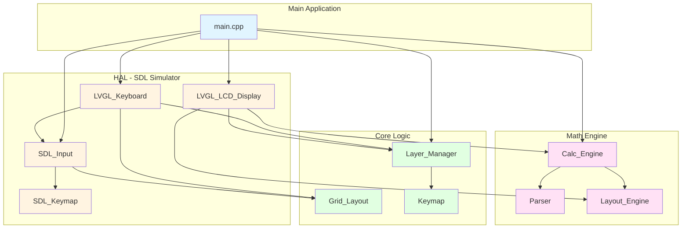
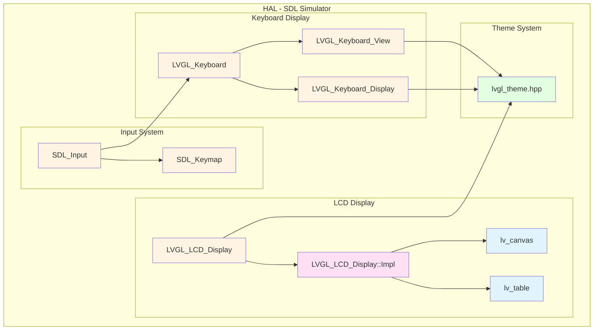
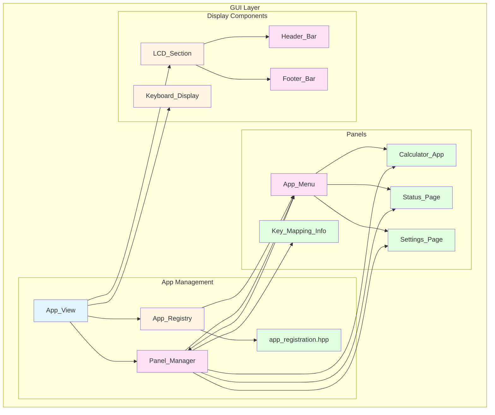
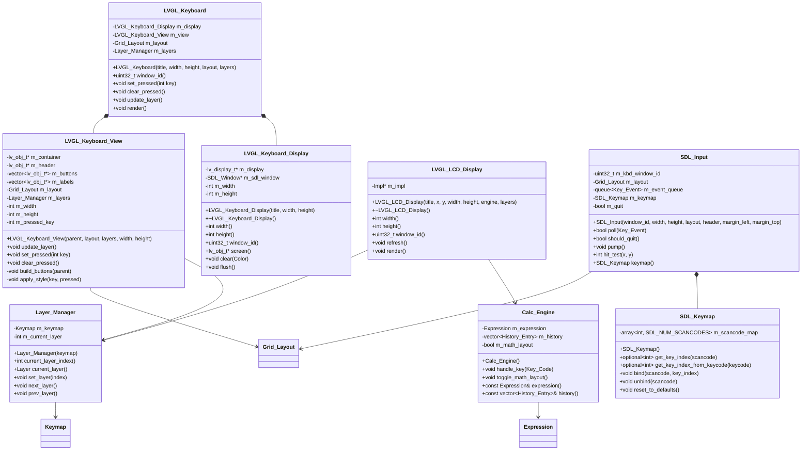
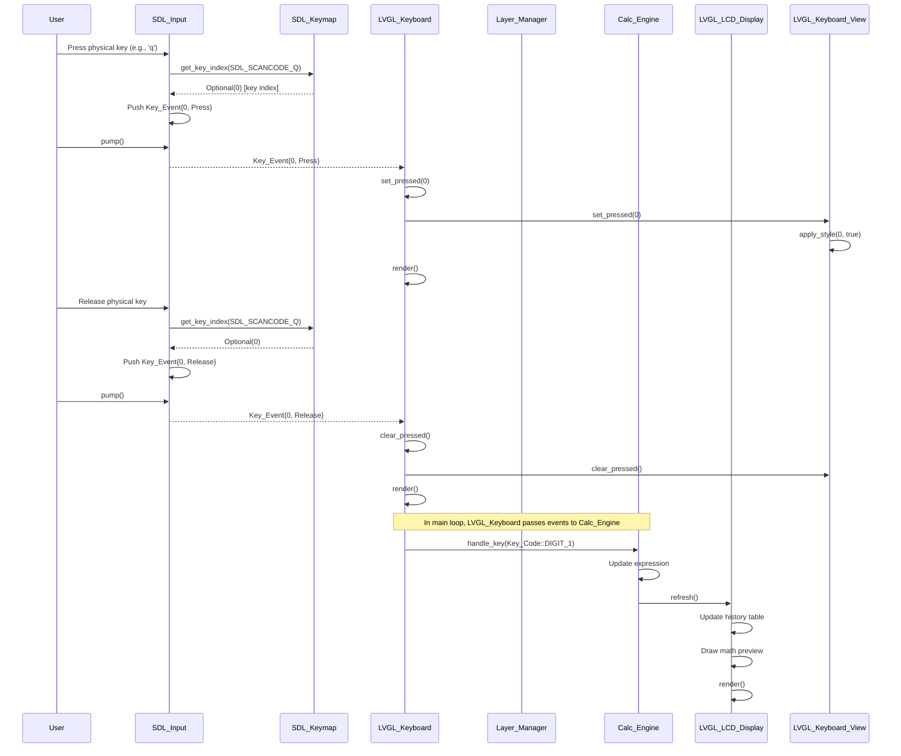
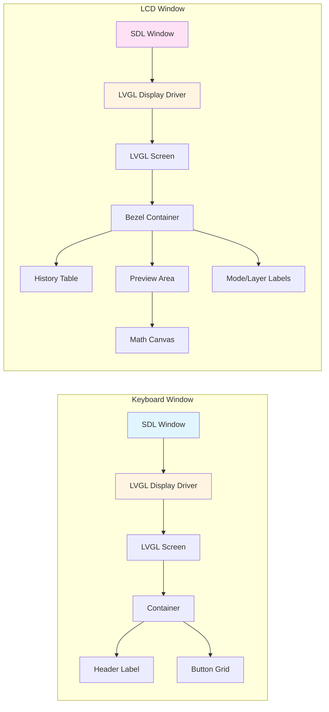
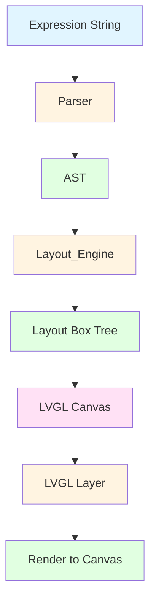
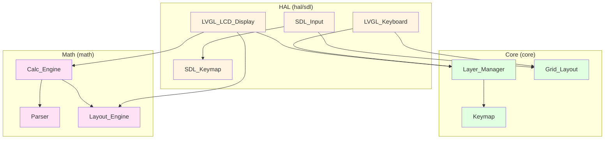
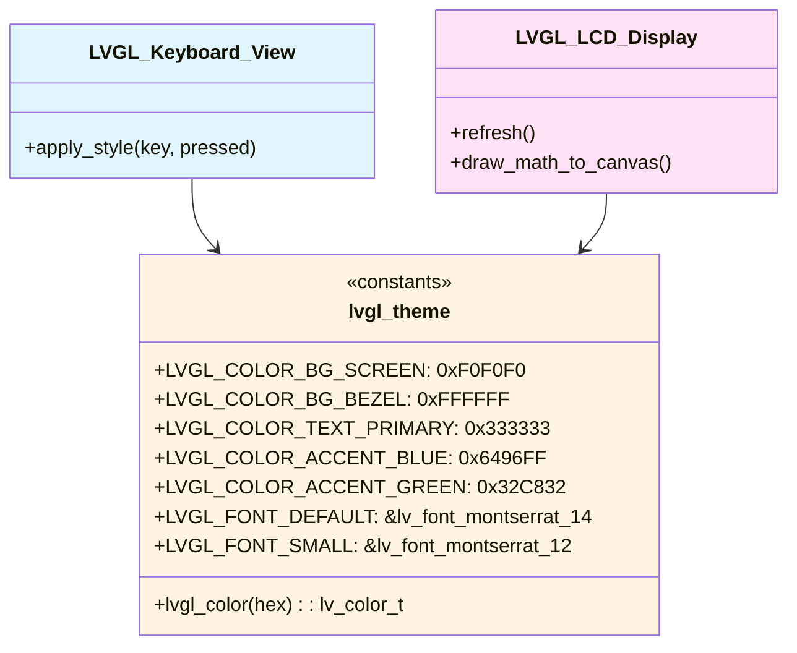
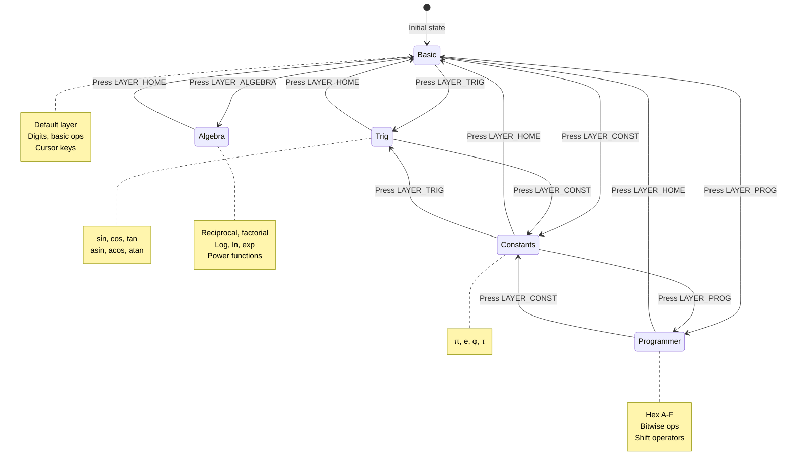

# System Diagrams

This document contains UML diagrams for the kbd_calc system architecture using Mermaid.

## High-Level Architecture

## HAL Module Breakout

## GUI Module Breakout

## SDL Simulator Class Diagram

## Input Handling Sequence Diagram

## LVGL Display Architecture

## Math Typesetting Flow

## Component Dependencies

## Theme System

## Layer Management

