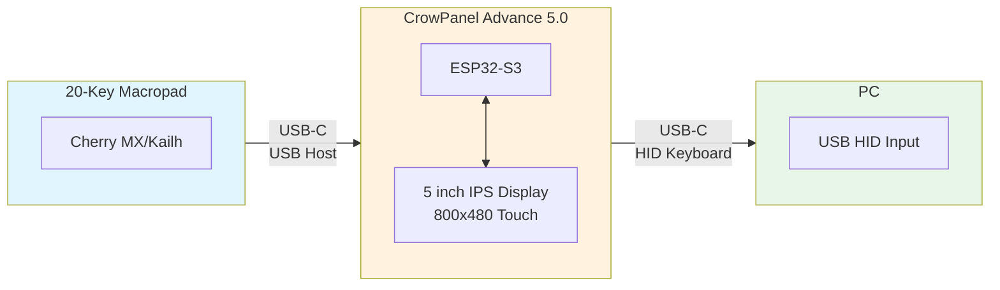
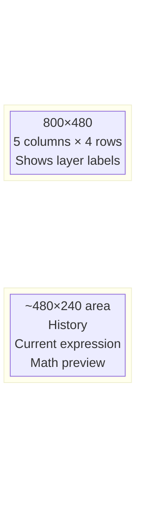

# Hardware

## Current Architecture (Interim Design)

Since LCD keys (NKK SmartDisplay) are not readily available for prototyping, the current implementation uses a **20-key macropad** paired with a **5-inch side LCD panel** displaying key labels.

### Components

#### Primary Display — CrowPanel Advance 5.0 HMI

**Product**: [CrowPanel Advance 5.0 HMI ESP32 AI Display](https://www.elecrow.com/crowpanel-advance-5-0-hmi-esp32-ai-display-800x480-ips-artificial-intelligent-touch-screen.html)

| Property           | Value                          |
|--------------------|--------------------------------|
| MCU                | ESP32-S3-WROOM-1-N16R8         |
| CPU                | Xtensa LX7 dual-core @ 240MHz  |
| RAM                | 512KB SRAM + 8MB PSRAM         |
| Flash              | 16MB                           |
| Display            | 5.0" IPS, 800×480, capacitive touch |
| Brightness         | 400 cd/m²                      |
| Viewing Angle      | 178°                           |
| Connectivity       | WiFi 2.4GHz, BLE 5.0, USB-C    |
| Audio              | Built-in mic + speaker         |
| Power              | 5V/2A via USB or battery       |

**Role**: Runs the calculator engine, renders the LCD UI (via LVGL), receives key events from macropad, and can forward keystrokes to a PC as a USB HID keyboard.

#### Input Device — 20-Key Macropad

Any standard USB HID macropad with mechanical switches:
- Cherry MX, Kailh, or Gateron switches
- USB-C connection to the ESP32 host port
- No display per key (labels shown on side LCD panel)

**Layout**: 5 columns × 4 rows to match the software grid (`GRID_COLS=5`, `GRID_ROWS=4`)

##### Selected: KISNT KN34 (34-Key Macropad with VIA)

**Product**: KISNT KN34 Mechanical Keypad (VIA-compatible firmware)

| Property           | Value                          |
|--------------------|--------------------------------|
| Keys               | 34 (8 columns × 7 rows)        |
| Dimensions         | 156 × 143 × 38.8 mm            |
| Switches           | Hot-swappable mechanical       |
| Connectivity       | USB-C, Bluetooth               |
| Features           | RGB backlight, rechargeable    |

**Notes**: The 34-key layout provides 14 extra keys beyond the 4-row calculator grid. These can be mapped to functions (clear, history, mode toggle, etc.) or left unused. The compact footprint is comparable to the target form factor.

### USB Architecture

The ESP32-S3 operates in dual USB roles:

| Role | Mode | Function |
|------|------|----------|
| **USB Host** | OTG Host | Receives key events from macropad via TinyUSB Host stack |
| **USB Device** | HID Keyboard | Sends keystrokes to PC as standard keyboard input |

### Display Layout

The 5" screen is split into two regions:

### Operating Modes

| Mode | Description |
|------|-------------|
| **Standalone** | Disconnected from PC. ESP32 runs full calculator, display shows keypad + LCD regions. |
| **Passthrough** | Connected to PC. Macropad keystrokes forwarded via USB HID. Display can mirror PC calculator or show status. |

---

## Reference — NKK SmartDisplay (Future Implementation)

**Part No.:** IS15BSBFP4RGB
**Series:** SmartDisplay™ — Compact Programmable LCD Pushbutton
**Product Page:** <https://www.nkkswitches.com/wp-content/themes/impress-blank/search/inc/part.php?part_no=IS15BSBFP4RGB>
**Datasheet:** <https://www.nkkswitches.com/pdf/IS15BSBFP4RGB_WideCmpct36x24.pdf>
**SmartDisplay Brochure:** <https://www.nkkswitches.com/pdf/NKKSmartDisplayBrochure.pdf>

### Key Specifications

| Property           | Value                  |
|--------------------|------------------------|
| Type               | Pushbutton, LCD        |
| Style              | Compact                |
| Outer Dimensions   | 19.0 mm × 18.0 mm × 23.0 mm |
| Display Mode       | Black & White, FSTN Positive |
| LED Color          | RGB (Red / Green / Blue) |
| Pixel Format (H×V) | 36 × 24                |
| Poles              | SPST-NO                |
| Circuit Action     | Off-Momentary          |
| Mounting           | Through Hole           |
| Logic Voltage      | 3 V – 5.5 V            |
| Max Clock Freq.    | 8 MHz                  |

### Notes

- Each key has an individually programmable LCD display surface — the simulator renders this via `SDL_Display` per-key labels in the keyboard window.
- The compact form factor (19 × 18 mm footprint) drives the calculator module's physical key pitch and overall PCB dimensions.
- RGB backlighting is used to indicate layer, mode, or key state in firmware.
- 3D CAD model available via NKK's PartCommunity library (linked on the product page).

**Status**: Reserved for future hardware revision when components are available. Current implementation uses standard mechanical switches with external LCD panel.
