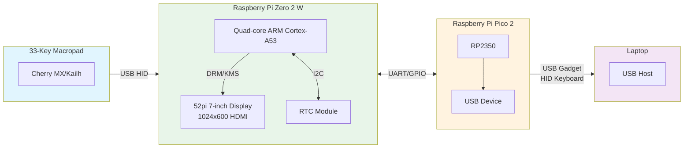
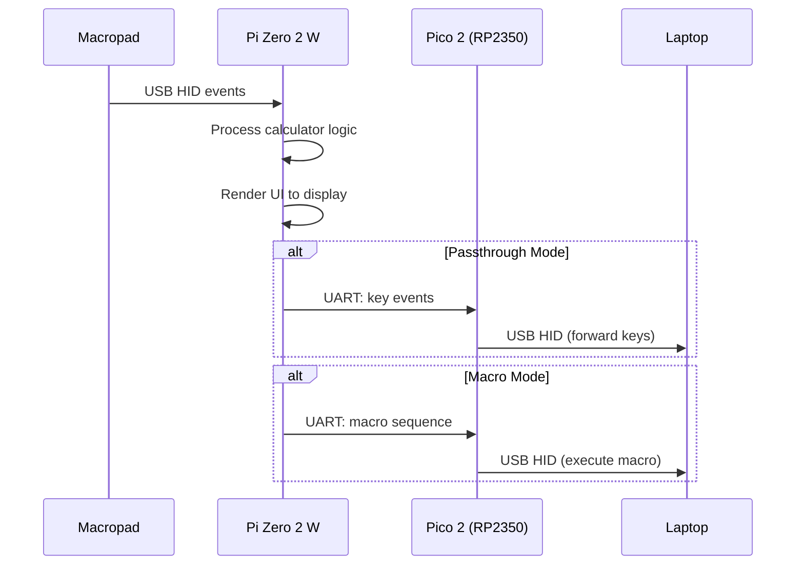
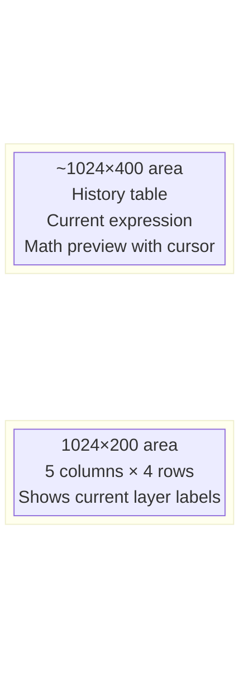

# Hardware

## Current Architecture

The calculator uses a **Raspberry Pi Zero 2 W** as the main compute platform, handling calculator logic, UI rendering, and macropad input. A **Raspberry Pi Pico 2 (RP2350)** provides USB gadget functionality, enabling the device to act as a USB HID keyboard when connected to a laptop (passthrough and macro modes).

```mermaid
flowchart LR
    subgraph Macropad["33-Key Macropad"]
        K[Cherry MX/Kailh]
    end

    subgraph PiZero["Raspberry Pi Zero 2 W"]
        CPU["Quad-core ARM Cortex-A53"]
        DISP["52pi 7-inch Display<br/>1024x600 HDMI"]
        RTC["RTC Module"]
        CPU -->|DRM/KMS| DISP
        CPU <-->|I2C| RTC
    end

    subgraph Pico["Raspberry Pi Pico 2"]
        MCU[RP2350]
        USB_DEV[USB Device]
        MCU --> USB_DEV
    end

    subgraph PC["Laptop"]
        HOST[USB Host]
    end

    Macropad -->|USB HID| PiZero
    PiZero <-->|UART/GPIO| Pico
    Pico -->|"USB Gadget<br/>HID Keyboard"| PC

    style Macropad fill:#e1f5fe
    style PiZero fill:#e8f5e9
    style Pico fill:#fff3e0
    style PC fill:#f3e5f5
```

### Components

#### Compute — Raspberry Pi Zero 2 W

**Product**: [Raspberry Pi Zero 2 W](https://www.raspberrypi.com/products/raspberry-pi-zero-2-w/)

| Property           | Value                          |
|--------------------|---------------------------------|
| CPU                | Quad-core ARM Cortex-A53 @ 1GHz |
| RAM                | 512MB LPDDR2                   |
| Storage            | microSD card                   |
| Connectivity       | 802.11 b/g/n WiFi, Bluetooth 4.2, BLE |
| Video Output       | mini HDMI (1080p60)            |
| GPIO               | 40-pin header                  |
| Power              | 5V via micro USB or GPIO       |

**Role**: Runs the calculator engine, renders the LCD UI (via LVGL + DRM/KMS), receives macropad input directly via USB HID, communicates with Pico 2 for USB gadget control (passthrough/macro modes).

#### Display — 52pi 7" HDMI Display

**Product**: 52pi 7" IPS Display with Capacitive Touch

| Property           | Value                          |
|--------------------|---------------------------------|
| Size               | 7.0" IPS                       |
| Resolution         | 1024×600                       |
| Touch              | 5-point capacitive touch       |
| Interface          | HDMI + USB touch               |
| Brightness         | 250 cd/m²                      |
| Viewing Angle      | 170°                           |
| Power              | 5V/2A via USB or GPIO          |

**Role**: Primary display for calculator UI, connected via HDMI to Pi Zero.

#### USB Interface — Raspberry Pi Pico 2 (RP2350)

**Product**: [Raspberry Pi Pico 2](https://www.raspberrypi.com/products/raspberry-pi-pico-2/)

| Property           | Value                          |
|--------------------|---------------------------------|
| MCU                | RP2350 (dual Cortex-M33 @ 150MHz) |
| RAM                | 520KB SRAM                     |
| Flash              | 4MB QSPI                       |
| GPIO               | 26 multi-function pins         |
| USB                | Native USB 1.1 device (gadget mode) |
| Connectivity       | UART, SPI, I2C                 |
| Power              | 5V via USB or VSYS pin         |

**Role**: USB gadget controller for laptop connectivity. Communicates with Pi Zero via UART/GPIO, acts as USB HID keyboard to laptop in passthrough/macro mode. Does not handle macropad input (macropad connects directly to Pi Zero).

#### Real-Time Clock — RTC Module

**Interface**: I2C connected to Pi Zero GPIO

| Property           | Value                          |
|--------------------|---------------------------------|
| Interface          | I2C (GPIO 2/3 on Pi Zero)      |
| Accuracy           | ±2 ppm typical                 |
| Battery Backup     | CR2032 coin cell               |
| Features           | Temperature-compensated crystal |

**Role**: Maintains accurate time when Pi Zero is powered off. Used by clock widgets (analog/digital) and solar calculation engine for sunrise/sunset times. Critical for standalone operation without network connectivity.

**Configuration**: Accessible via `/dev/rtc0` on Linux. System time synced from RTC on boot, written back on shutdown.

#### Input Device — TH33 Macropad

**Product**: Epomaker TH33 33-Key Mechanical Macropad

| Property           | Value                          |
|--------------------|--------------------------------|
| Brand              | Epomaker                       |
| Keys               | 33 keys (configurable layout)  |
| Switches           | Hot-swappable mechanical       |
| Connectivity       | USB-C                          |
| Firmware           | VIA-compatible                 |
| Features           | RGB backlight, full programmability |

**Connection**: USB HID directly to Pi Zero

**Layout**: Configured via VIA to match the calculator's 5×4 grid with additional function keys. Extra keys can trigger mode switching, macros, or calculator functions.

**Notes**: The VIA-compatible firmware allows remapping function keys (F1-F10) to trigger calculator menus and operations. Pi Zero reads keyboard input via Linux `/dev/input/event*` devices.

### System Architecture

#### Communication Flow

```mermaid
sequenceDiagram
    participant Macropad
    participant PiZero as Pi Zero 2 W
    participant Pico as Pico 2 (RP2350)
    participant Laptop
    
    Macropad->>PiZero: USB HID events
    PiZero->>PiZero: Process calculator logic
    PiZero->>PiZero: Render UI to display
    
    alt Passthrough Mode
        PiZero->>Pico: UART: key events
        Pico->>Laptop: USB HID (forward keys)
    end
    
    alt Macro Mode
        PiZero->>Pico: UART: macro sequence
        Pico->>Laptop: USB HID (execute macro)
    end
```

#### Pico 2 Responsibilities

| Function | Description |
|----------|-------------|
| **USB Device/Gadget** | Acts as HID keyboard to laptop |
| **UART Bridge** | Receives commands from Pi Zero (key events, macro sequences) |
| **Mode Controller** | Switches between passthrough/macro modes based on Pi Zero commands |

### Display Layout

The 7" screen (1024×600) is split into two regions:

```mermaid
block-beta
    columns 1
    space
    block:Calculator_LCD:1
        LCD["~1024×400 area<br/>History table<br/>Current expression<br/>Math preview with cursor"]
    end
    space
    block:Virtual_Keypad:1
        Keypad["1024×200 area<br/>5 columns × 4 rows<br/>Shows current layer labels"]
    end
    space
```

### Operating Modes

| Mode | Description | Pico 2 Role |
|------|-------------|-------------|
| **Standalone** | Disconnected from laptop. Pi Zero receives macropad input directly, runs full calculator, renders UI to display. | Inactive (not connected to laptop) |
| **Passthrough** | Connected to laptop. Pi Zero forwards macropad keystrokes to Pico 2 via UART, which sends them as USB HID keyboard events to laptop. | USB HID keyboard forwarding raw events |
| **Macro** | Connected to laptop. Pi Zero processes macropad input, sends macro sequences to Pico 2, which types them to laptop. Calculator UI shows active macros. | USB HID keyboard executing macro sequences |

**Mode Switching**: Triggered by special key combination on macropad (e.g., Fn+Mode key). Pi Zero detects mode change request and updates display, activates/deactivates Pico 2 USB gadget functionality accordingly.

---

