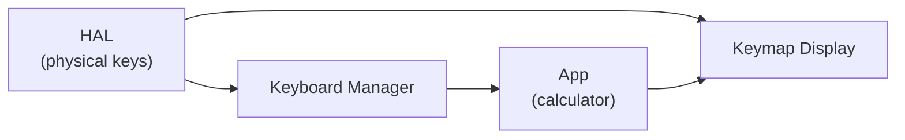

# Keyboard Architecture Proposal

## Overview

Two-tier architecture separates **hardware input** from **key mapping**:

| Component | Responsibility |
|-----------|---------------|
| **HAL** | Raw input events from physical keys (no meaning, just "key 17 pressed") |
| **Keyboard Manager** | Maps physical keys to actions, handles layers/modes, drives the visual keymap display |

The **app** (calculator) defines calculator-specific modes (Trig, Algebra, etc.) that request key remapping from the Keyboard Manager.

---

## HAL Responsibilities

The Hardware Abstraction Layer only knows about physical reality:

1. **Physical key events** — "key index 17 was pressed/released"
2. **Modifier states** — Shift, Ctrl, Alt, Caps Lock (as reported by hardware)
3. **Physical geometry** — key positions for optional visual display

HAL does **not** know what key 17 *means*. That's the Keyboard Manager's job.

### Per-Board Configs

Each physical keyboard has its own config:

```
data/configs/
  mf/keyboard.json        # 34-key macropad
  picocalc/keyboard.json  # Full QWERTY
```

### Example: MF34 Macropad

MF34 has 34 keys. No letters, just digits, operators, navigation.

```json
{
  "name": "MF34",
  "keys": { /* 34 key positions for visual display */ },
  "hardware_layers": [
    { "name": "Base" }  // MF has no Shift/Caps layers
  ]
}
```

### Example: PicoCalc (Full QWERTY)

```json
{
  "name": "PicoCalc",
  "keys": { /* QWERTY key positions */ },
  "hardware_layers": [
    { "name": "Base" },   // lowercase
    { "name": "Shift" }, // symbols - = becomes +, [ becomes {
    { "name": "Caps" }    // uppercase
  ]
}
```

Hardware layers are **physical reality** — Shift exists because the keyboard sends different scancodes when Shift is held.

---

## Keyboard Manager

The Keyboard Manager is the middle layer between HAL and App:



### Responsibilities

1. **Map physical keys to actions** — key 17 → Action_Code::DIGIT_7
2. **Handle hardware layers** — Shift, Caps Lock state changes
3. **Drive the keymap display** — optional visual keyboard below main window
4. **Support app-specific remapping** — calculator can request temporary key redefinition

### API Sketch

```cpp
class Keyboard_Manager {
public:
    // App registers its modes
    void register_mode(const std::string& name, Mode_Definition mode);

    // App switches mode
    void set_mode(const std::string& name);

    // App temporarily remaps specific keys (e.g., function menu)
    void set_key_mapping(int key_index, Action_Code action, std::string label);
    void clear_key_mapping(int key_index);  // Back to mode default
    void reset_key_mappings();              // Back to mode defaults

    // Get action for a physical key event
    Action_Code lookup_action(int key_index) const;

    // Get display label for a key (for visual keymap)
    std::string get_label(int key_index) const;

    // Hardware layer state
    bool is_shift_active() const;
    bool is_caps_active() const;
};
```

---

## Calculator Modes (App-Defined)

The calculator defines modes that work with whatever keys are available:

| Mode | Description | MF34 Example | PicoCalc Example |
|------|-------------|--------------|------------------|
| **Basic** | Standard arithmetic | Digits, +, −, ×, ÷ | Same + more keys |
| **Trig** | sin, cos, tan, etc. | Key 17→sin, 18→cos, 19→tan | Dedicated sin/cos/tan keys |
| **Algebra** | Variables | Key 17→x, 18→y, 19→z | Same |
| **Programmer** | Hex, bitwise | Key 17→A, 18→B, 19→C... | Dedicated A-F keys |

Mode definitions are per-keyboard or shared:

```
src/calculator/modes/
  mode_definitions.hpp       // Action_Code mappings
  mf34_modes.cpp             // MF34-specific key assignments
  picocalc_modes.cpp         // PicoCalc-specific assignments
```

---

## Key Insight: Sub-Layers Within Apps

The calculator can temporarily remap keys without changing "mode":

**Example: Function Menu in Calculator**

1. User is in **Basic** mode, typing `2+3`
2. User presses **Menu** key → Calculator opens function menu
3. Calculator calls: `keyboard_mgr.set_key_mapping(17, SIN, "sin")`
4. Keymap display updates: key 17 now shows "sin"
5. User presses key 17 → App receives `SIN` action
6. User exits menu → Calculator calls `keyboard_mgr.reset_key_mappings()`
7. Key 17 returns to showing "7" (Basic mode default)

This is **not** a mode change — it's a temporary overlay for a specific UI context.

---

## SDL HAL Responsibilities

The SDL HAL for simulator targets:

1. Creates the **main calculator window** (LCD display)
2. Optionally creates **keymap display window** below main window (for visual reference)
3. Forwards physical key events to Keyboard Manager
4. Forwards Shift/Caps state to Keyboard Manager

The keymap display is **not** the calculator's UI — it's a visual aid showing what the physical keys do in the current mode.

---

## Implementation Strategy

### Phase 1: MF34 First
Start with the simpler keyboard (34 keys, no hardware layers):
- Implement Keyboard_Manager
- Single "Base" hardware layer
- App-defined modes (Basic, Trig, Algebra)
- No Shift/Caps complexity

### Phase 2: PicoCalc
Add full QWERTY support:
- Hardware layers: Base, Shift, Caps
- Shift key shows symbols layer (= becomes +, etc.)
- Caps Lock toggles uppercase
- Same mode system as MF34

### Phase 3: Sub-Layers
Add temporary remapping for in-app menus:
- `set_key_mapping()` / `reset_key_mappings()` API
- Function menus, variable picker, etc.

---

## Open Questions

1. **How does Shift interact with calculator modes?**
   - MF34: No hardware Shift layer — Shift key could be a modifier for app modes
   - PicoCalc: Shift shows symbol layer, independent of calculator mode

2. **Mode switching**
   - Dedicated key? (Mode cycles Basic→Trig→Algebra→...)
   - Menu-driven?
   - Direct access keys? (Fn+1 = Basic, Fn+2 = Trig)

3. **Visual keymap display**
   - Always show below main window?
   - Toggleable?
   - Only for simulator targets?

4. **MF34 Shift key**
   - Since MF has no letters, what does Shift do?
   - Option A: App mode modifier (Shift+7 = sin in Trig mode)
   - Option B: Secondary function layer (like Fn key)
   - Option C: Pass through to host OS

---

## User Stories / Expected Behaviors

These scenarios define how the system should behave across different keyboards.

### Status Mode Navigation

**Story:** When viewing calculator status (registers, memory, etc.), the user needs consistent navigation regardless of physical keyboard.

**Given** the app is in "Status Mode"
**Then** these mappings apply:

| Action | MF34 (Macropad) | PicoCalc (QWERTY) |
|--------|-----------------|-------------------|
| Exit to menu | Escape key | Escape key |
| Navigate up | Up arrow | Up arrow or Shift+Up |
| Navigate down | Down arrow | Down arrow or Shift+Down |

**Note:** Common actions use the same key where possible (Escape). Navigation uses arrow keys on both boards.

---

### Function Popups

**Story:** The calculator has 5 popup overlays (F1-F5 functions). Different keyboards use different physical keys to trigger them.

**Given** the app is in calculator mode
**When** the user presses a function trigger key
**Then** the corresponding popup appears:

| Popup | PicoCalc (QWERTY) | MF34 (Macropad) |
|-------|-------------------|-----------------|
| F1 popup | F1 key | *TBD* (different key) |
| F2 popup | F2 key | *TBD* (different key) |
| F3 popup | F3 key | *TBD* (different key) |
| F4 popup | F4 key | *TBD* (different key) |
| F5 popup | F5 key | *TBD* (different key) |

**Rationale:** The PicoCalc has dedicated F-keys. The MF34 will use its available keys (likely top-row digits or operators) for these functions. The exact mapping will be determined once the build is working and we can test the physical layout.

---

### Calculator Mode Switching

**Story:** Users switch between calculator modes (Basic, Trig, Algebra, etc.) using whatever keys are available on their keyboard.

**Scenario A: Direct Access**
**Given** the user wants immediate mode access
**Then:**
- **PicoCalc:** Dedicated mode keys or Fn+number combinations
- **MF34:** Top-row keys double as mode selectors (e.g., key "1" enters Basic mode, key "2" enters Trig mode)

**Scenario B: Menu-Driven**
**Given** the user doesn't remember mode shortcuts
**Then:**
- Both boards: Press Menu key, navigate to desired mode, press Enter

---

### Key Remapping in Menus

**Story:** When a popup menu appears, keys temporarily take on new meanings.

**Given** a popup menu is displayed
**When** the Keyboard Manager receives `set_key_mapping()` calls from the app
**Then:**
- The visual keymap display updates to show temporary labels
- Physical key presses resolve to the temporary actions
- When the popup closes, `reset_key_mappings()` restores the previous mode

**Example:** Variable picker popup
- Normally: "1" key → digit 1
- In popup: "1" key → select variable 1

---

## Files to Create/Modify

| File | Purpose |
|------|---------|
| `src/overboard/core/keyboard_manager.hpp/cpp` | New: Keyboard Manager class |
| `src/overboard/hal/modes/*.hpp/cpp` | New: Mode definitions per keyboard |
| `data/configs/mf/keyboard.json` | Simplified: just 34 key positions |
| `data/configs/picocalc/keyboard.json` | Unified QWERTY key positions + layers |
| `src/overboard/hal/sdl/app.cpp` | Modified: Use Keyboard Manager, drive keymap display |
| `src/overboard/gui/keymap_display.hpp/cpp` | New: Optional visual keymap window |

