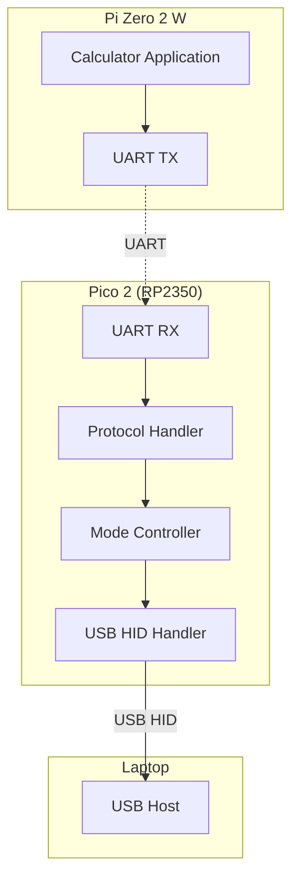
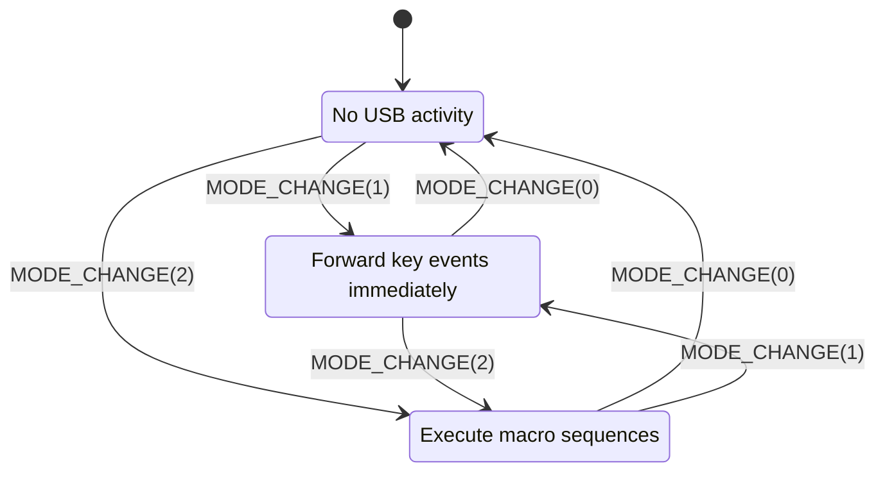

# Pico 2 USB Gadget Design

## Overview

The Raspberry Pi Pico 2 (RP2350) acts as a USB HID keyboard gadget, enabling the calculator to interface with a laptop. It receives commands from the Pi Zero via UART and translates them into USB HID keyboard events.

## Architecture



## Development Tools & SDKs

### 1. Pico SDK (Primary)

**SDK**: [Raspberry Pi Pico SDK](https://github.com/raspberrypi/pico-sdk)

**Language**: C/C++

**Features**:
- Native RP2350 support
- Built-in TinyUSB integration
- UART drivers (hardware UART0/UART1)
- GPIO, timers, interrupts
- CMake build system

### 2. TinyUSB (USB Stack)

**Library**: Built into Pico SDK

**Purpose**: USB device/gadget stack with HID class support

**Features**:
- USB HID keyboard descriptor support
- Multiple HID report types (keyboard, mouse, consumer control)
- Boot protocol and report protocol
- Low-level USB enumeration and control

**API**: `tusb_config.h`, `usb_descriptors.c`, `tud_hid_*` functions


## UART Protocol Design

### Physical Layer

| Parameter | Value |
|-----------|-------|
| **Interface** | UART0 (GPIO 0/1 on Pico 2) |
| **Baud Rate** | 115200 |
| **Data Bits** | 8 |
| **Parity** | None |
| **Stop Bits** | 1 |
| **Flow Control** | None (software only) |
| **Direction** | Pi Zero → Pico 2 (unidirectional for now) |

**Future Enhancement**: Add Pico → Pi Zero for status/ACK messages

### Message Format

All messages follow a simple framed protocol:

```
┌──────┬──────┬──────────┬────────────────┬──────┐
│ SOF  │ LEN  │  TYPE    │    PAYLOAD     │ CRC  │
├──────┼──────┼──────────┼────────────────┼──────┤
│ 1B   │ 1B   │  1B      │   0-252 bytes  │ 1B   │
└──────┴──────┴──────────┴────────────────┴──────┘
```

**Fields**:
- `SOF` (Start of Frame): `0xAA` (constant)
- `LEN`: Total message length (including SOF, LEN, TYPE, CRC)
- `TYPE`: Message type code (see below)
- `PAYLOAD`: Message-specific data
- `CRC`: 8-bit CRC-8 (polynomial 0x07)

**Maximum Message Size**: 256 bytes

### Message Types

#### 0x01 - Mode Change

**Direction**: Pi Zero → Pico 2

**Purpose**: Switch between operating modes

**Payload**:
```c
struct mode_change_msg {
    uint8_t mode;  // 0=Inactive, 1=Passthrough, 2=Macro
};
```

**Modes**:
- `0x00`: Inactive (no USB activity)
- `0x01`: Passthrough (forward raw key events)
- `0x02`: Macro (execute macro sequences)

#### 0x02 - Key Event

**Direction**: Pi Zero → Pico 2

**Purpose**: Send single key press/release event

**Payload**:
```c
struct key_event_msg {
    uint8_t modifiers;  // Bit mask: Ctrl, Shift, Alt, GUI
    uint8_t keycode;    // USB HID keycode
    uint8_t action;     // 0=Release, 1=Press
};
```

**Modifier Bits** (standard USB HID):
- Bit 0: Left Ctrl
- Bit 1: Left Shift
- Bit 2: Left Alt
- Bit 3: Left GUI (Windows/Command)
- Bit 4: Right Ctrl
- Bit 5: Right Shift
- Bit 6: Right Alt
- Bit 7: Right GUI

**Keycode**: Standard USB HID usage codes (see USB HID Usage Tables)

#### 0x03 - Macro Sequence

**Direction**: Pi Zero → Pico 2

**Purpose**: Execute a sequence of key events

**Payload**:
```c
struct macro_sequence_msg {
    uint8_t  count;              // Number of actions (max 126)
    struct {
        uint8_t modifiers;
        uint8_t keycode;
        uint8_t action;          // 0=Release, 1=Press
        uint8_t delay_ms;        // Delay after this action (0-255ms)
    } actions[count];
};
```

**Example - Type "Hello"**:
```
count = 10
actions[0] = {0x02, 0x0B, 0x01, 0}  // Shift+H press
actions[1] = {0x02, 0x0B, 0x00, 10} // Shift+H release, 10ms delay
actions[2] = {0x00, 0x08, 0x01, 0}  // E press
actions[3] = {0x00, 0x08, 0x00, 10} // E release, 10ms delay
...
```

#### 0x04 - Text String

**Direction**: Pi Zero → Pico 2

**Purpose**: Type a UTF-8 text string (converted to key sequences by Pico)

**Payload**:
```c
struct text_string_msg {
    uint8_t length;          // String length (0-251)
    char    text[length];    // UTF-8 text (null-terminated)
};
```

**Note**: Pico firmware translates UTF-8 characters to appropriate HID keycodes with modifiers.

#### 0x05 - Consumer Control

**Direction**: Pi Zero → Pico 2

**Purpose**: Send media/consumer control events (volume, play/pause, etc.)

**Payload**:
```c
struct consumer_control_msg {
    uint16_t usage_id;  // USB HID Consumer Page usage ID
    uint8_t  action;    // 0=Release, 1=Press
};
```

**Common Usage IDs**:
- `0x00E9`: Volume Up
- `0x00EA`: Volume Down
- `0x00E2`: Mute
- `0x00CD`: Play/Pause
- `0x00B5`: Next Track
- `0x00B6`: Previous Track

#### 0xF0 - Ping

**Direction**: Pi Zero → Pico 2

**Purpose**: Keepalive / connection test

**Payload**: None

**Response**: Pico 2 can send ACK (future enhancement)

#### 0xFF - Reset

**Direction**: Pi Zero → Pico 2

**Purpose**: Reset Pico state, clear buffers, return to inactive mode

**Payload**: None

### Error Handling

**CRC Failure**: Discard message, no response (Pi Zero should retry)

**Unknown Message Type**: Discard message, log error

**Buffer Overflow**: Discard partial message, resync on next SOF

**Timeout**: If no complete message received within 100ms, discard partial data

## USB HID Implementation

### HID Descriptor

The Pico 2 presents itself as a **composite HID device** with two interfaces:

1. **Keyboard Interface** (Report ID 1)
2. **Consumer Control Interface** (Report ID 2)

**Device Descriptor**:
```c
#define USB_VID           0x2E8A  // Raspberry Pi vendor ID
#define USB_PID           0x1234  // Custom product ID
#define USB_MANUFACTURER  "Overboard"
#define USB_PRODUCT       "Calculator HID Bridge"
```

**Keyboard HID Report Descriptor**:
```c
// Standard boot keyboard report (8 bytes)
// Based on USB HID Usage Tables v1.12
uint8_t const desc_hid_keyboard_report[] = {
    HID_USAGE_PAGE ( HID_USAGE_PAGE_DESKTOP     ),
    HID_USAGE      ( HID_USAGE_DESKTOP_KEYBOARD ),
    HID_COLLECTION ( HID_COLLECTION_APPLICATION ),
        // Report ID
        HID_REPORT_ID  ( 0x01 ),
        
        // Modifier keys (Ctrl, Shift, Alt, GUI)
        HID_USAGE_PAGE ( HID_USAGE_PAGE_KEYBOARD ),
        HID_USAGE_MIN  ( 0xE0 ),
        HID_USAGE_MAX  ( 0xE7 ),
        HID_LOGICAL_MIN( 0x00 ),
        HID_LOGICAL_MAX( 0x01 ),
        HID_REPORT_COUNT( 8 ),
        HID_REPORT_SIZE( 1 ),
        HID_INPUT      ( HID_DATA | HID_VARIABLE | HID_ABSOLUTE ),
        
        // Reserved byte
        HID_REPORT_COUNT( 1 ),
        HID_REPORT_SIZE( 8 ),
        HID_INPUT      ( HID_CONSTANT ),
        
        // Keycodes (up to 6 simultaneous keys)
        HID_USAGE_PAGE ( HID_USAGE_PAGE_KEYBOARD ),
        HID_USAGE_MIN  ( 0x00 ),
        HID_USAGE_MAX  ( 0xFF ),
        HID_LOGICAL_MIN( 0x00 ),
        HID_LOGICAL_MAX( 0xFF ),
        HID_REPORT_COUNT( 6 ),
        HID_REPORT_SIZE( 8 ),
        HID_INPUT      ( HID_DATA | HID_ARRAY | HID_ABSOLUTE ),
    HID_COLLECTION_END
};
```

**Report Format** (8 bytes):
```c
struct keyboard_report {
    uint8_t modifiers;      // Bit mask of modifier keys
    uint8_t reserved;       // Always 0
    uint8_t keycode[6];     // Up to 6 simultaneous keys
};
```

### TinyUSB API Usage

**Initialization**:
```c
void usb_hid_init(void) {
    // TinyUSB handles enumeration automatically
    tusb_init();
}
```

**Main Loop**:
```c
void usb_hid_task(void) {
    tud_task();  // TinyUSB device task
    
    if (tud_hid_ready()) {
        // Check for pending key events from UART
        if (has_pending_key_event()) {
            keyboard_report_t report;
            build_keyboard_report(&report);
            tud_hid_keyboard_report(REPORT_ID_KEYBOARD, 
                                   report.modifiers, 
                                   report.keycode);
        }
    }
}
```

**Send Key Press**:
```c
void send_key_press(uint8_t modifiers, uint8_t keycode) {
    uint8_t keycodes[6] = {keycode, 0, 0, 0, 0, 0};
    tud_hid_keyboard_report(REPORT_ID_KEYBOARD, modifiers, keycodes);
}
```

**Send Key Release**:
```c
void send_key_release(void) {
    // Send empty report (all keys released)
    tud_hid_keyboard_report(REPORT_ID_KEYBOARD, 0, NULL);
}
```

**Consumer Control**:
```c
void send_consumer_control(uint16_t usage_id) {
    tud_hid_report(REPORT_ID_CONSUMER, &usage_id, 2);
}
```

## Firmware State Machine

### Operating Modes



### Event Handling

**Passthrough Mode**:
```c
void handle_key_event_passthrough(key_event_msg_t *msg) {
    if (msg->action == KEY_PRESS) {
        send_key_press(msg->modifiers, msg->keycode);
    } else {
        send_key_release();
    }
}
```

**Macro Mode**:
```c
void handle_macro_sequence(macro_sequence_msg_t *msg) {
    for (int i = 0; i < msg->count; i++) {
        if (msg->actions[i].action == KEY_PRESS) {
            send_key_press(msg->actions[i].modifiers, 
                          msg->actions[i].keycode);
        } else {
            send_key_release();
        }
        
        if (msg->actions[i].delay_ms > 0) {
            sleep_ms(msg->actions[i].delay_ms);
        }
    }
    // Send final key release
    send_key_release();
}
```

## Implementation Plan

### Phase 1: Basic Infrastructure
- [x] Set up Pico SDK build environment
- [ ] Implement UART receive with framing
- [ ] Implement CRC-8 validation
- [ ] Create protocol parser
- [ ] Add basic logging/debugging

### Phase 2: USB HID Keyboard
- [ ] Configure TinyUSB for HID keyboard
- [ ] Implement keyboard HID descriptor
- [ ] Test with simple key events
- [ ] Verify with USB analyzer tool

### Phase 3: Mode Controller
- [ ] Implement mode state machine
- [ ] Add passthrough mode handler
- [ ] Add macro mode handler
- [ ] Test mode transitions

### Phase 4: Protocol Messages
- [ ] Implement MODE_CHANGE handler
- [ ] Implement KEY_EVENT handler
- [ ] Implement MACRO_SEQUENCE handler
- [ ] Implement TEXT_STRING handler (with UTF-8 → HID translation)

### Phase 5: Consumer Control
- [ ] Add consumer control HID descriptor
- [ ] Implement CONSUMER_CONTROL handler
- [ ] Test media keys

### Phase 6: Reliability
- [ ] Add watchdog timer
- [ ] Implement UART error recovery
- [ ] Add keepalive/ping mechanism
- [ ] Stress testing with rapid key events

### Phase 7: Optimization
- [ ] Measure latency (UART → USB)
- [ ] Optimize UART buffering
- [ ] Profile CPU usage
- [ ] Reduce power consumption

## Pi Zero Integration

### UART Configuration (Linux)

**Device Tree Overlay** (`/boot/config.txt`):
```
dtoverlay=uart0
```

**Serial Port**: `/dev/serial0` (mapped to GPIO 14/15)

**Disable Console**: Remove `console=serial0,115200` from `/boot/cmdline.txt`

### Python Library (Pi Zero)

```python
import serial
import struct
import crc8

class PicoHIDBridge:
    SOF = 0xAA
    
    MSG_MODE_CHANGE = 0x01
    MSG_KEY_EVENT = 0x02
    MSG_MACRO_SEQUENCE = 0x03
    MSG_TEXT_STRING = 0x04
    MSG_CONSUMER_CONTROL = 0x05
    MSG_RESET = 0xFF
    
    def __init__(self, port='/dev/serial0', baudrate=115200):
        self.ser = serial.Serial(port, baudrate, timeout=0.1)
        self.crc = crc8.crc8()
    
    def _send_message(self, msg_type, payload):
        length = 5 + len(payload)  # SOF + LEN + TYPE + PAYLOAD + CRC
        message = struct.pack('BBB', self.SOF, length, msg_type) + payload
        
        # Calculate CRC (excluding SOF)
        self.crc.reset()
        self.crc.update(message[1:])
        message += bytes([self.crc.digest()[0]])
        
        self.ser.write(message)
    
    def set_mode(self, mode):
        """Mode: 0=Inactive, 1=Passthrough, 2=Macro"""
        self._send_message(self.MSG_MODE_CHANGE, bytes([mode]))
    
    def send_key_event(self, modifiers, keycode, action):
        """Action: 0=Release, 1=Press"""
        payload = struct.pack('BBB', modifiers, keycode, action)
        self._send_message(self.MSG_KEY_EVENT, payload)
    
    def send_text(self, text):
        """Send UTF-8 text string"""
        text_bytes = text.encode('utf-8')
        payload = struct.pack('B', len(text_bytes)) + text_bytes + b'\x00'
        self._send_message(self.MSG_TEXT_STRING, payload)
    
    def send_macro(self, actions):
        """
        actions: list of (modifiers, keycode, action, delay_ms) tuples
        """
        payload = struct.pack('B', len(actions))
        for mod, key, act, delay in actions:
            payload += struct.pack('BBBB', mod, key, act, delay)
        self._send_message(self.MSG_MACRO_SEQUENCE, payload)

# Example usage
bridge = PicoHIDBridge()

# Enter passthrough mode
bridge.set_mode(1)

# Send 'A' key press
bridge.send_key_event(0x02, 0x04, 1)  # Shift+A press
bridge.send_key_event(0x02, 0x04, 0)  # Shift+A release

# Type "Hello World"
bridge.send_text("Hello World")

# Execute macro (Ctrl+C)
bridge.send_macro([
    (0x01, 0x06, 1, 0),   # Ctrl+C press
    (0x01, 0x06, 0, 10),  # Ctrl+C release, 10ms delay
])
```

### C++ Integration (Pi Zero HAL)

Add to `hal/pi_zero/`:

```cpp
class Pico_HID_Bridge {
    public:
        Pico_HID_Bridge(std::string_view uart_device = "/dev/serial0");
        
        void set_mode(Mode mode);
        void send_key_event(uint8_t modifiers, uint8_t keycode, bool press);
        void send_text(std::string_view text);
        void send_macro(std::span<Macro_Action> actions);
        
    private:
        int m_uart_fd;
        void send_message(uint8_t type, std::span<uint8_t> payload);
        uint8_t calculate_crc(std::span<uint8_t> data);
};
```

## Testing Strategy

### Unit Tests (Pico Firmware)
- Protocol parser with malformed messages
- CRC validation
- UART framing and error recovery
- State machine transitions

### Integration Tests (Pi Zero → Pico)
- Send key events, verify USB output with USB analyzer
- Test mode transitions
- Macro execution timing
- Text string conversion

### System Tests (End-to-End)
- Passthrough: Type on macropad, verify laptop receives input
- Macro: Trigger macro, verify laptop executes sequence
- Latency: Measure delay from macropad press to laptop input

### Tools
- **USB Analyzer**: Beagle USB 480 or software analyzer (usbmon on Linux)
- **Logic Analyzer**: Saleae or similar for UART debugging
- **Test Scripts**: Python scripts to send various message sequences

## Reference Materials

### Documentation
- [Pico SDK Documentation](https://www.raspberrypi.com/documentation/pico-sdk/)
- [TinyUSB Documentation](https://docs.tinyusb.org/)
- [USB HID Usage Tables](https://usb.org/sites/default/files/hut1_3_0.pdf)
- [USB HID Specification](https://www.usb.org/sites/default/files/hid1_11.pdf)

### Example Code
- [Pico Examples - USB HID](https://github.com/raspberrypi/pico-examples/tree/master/usb/device/dev_hid_composite)
- [TinyUSB Examples - HID Keyboard](https://github.com/hathach/tinyusb/tree/master/examples/device/hid_composite)

### Tools
- [picotool](https://github.com/raspberrypi/picotool) - Pico board utility
- [picoprobe](https://github.com/raspberrypi/picoprobe) - Debug probe using another Pico
- [Wireshark](https://www.wireshark.org/) - USB packet capture (with usbmon)

## Future Enhancements

### Bidirectional Communication
Add Pico → Pi Zero messages for:
- ACK/NACK for received messages
- USB connection status
- Caps Lock / Num Lock LED state
- Error reporting

### Power Management
- USB suspend/resume handling
- Low-power mode when inactive
- Wake-on-USB for Pi Zero

### Security
- Message authentication (HMAC)
- Encrypted payload for sensitive data
- Anti-replay protection

### Advanced Features
- Mouse/pointer emulation
- Gamepad HID support
- Custom HID reports for special functions
- Firmware update over UART
