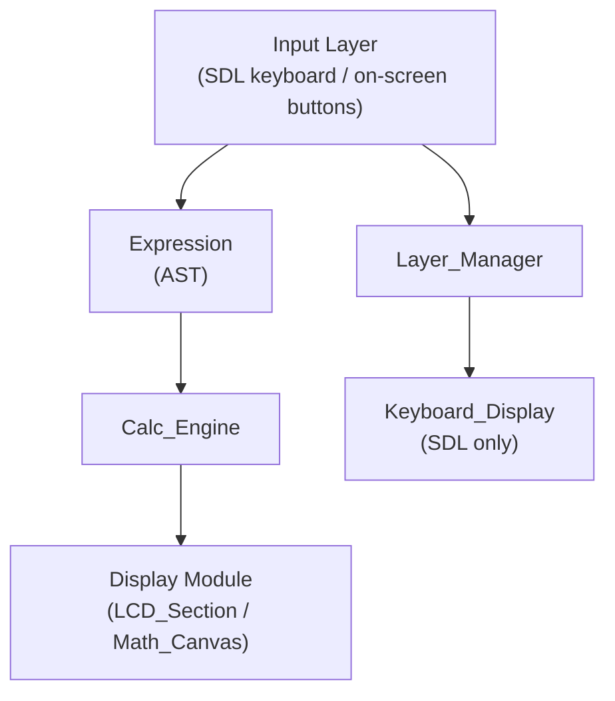

# Project Tasks

## Architecture

---

## Phase 2: Calculator — Basic Algebra  ← **NEXT**

Goal: Get the calculator working end-to-end for basic arithmetic and algebra.

- [ ] **Error handling strategy** — currently `draw_math_to_canvas` silently swallows render exceptions to `std::cerr`. Define a proper policy
- [ ] Digits, operators (`+`, `-`, `*`, `/`), parentheses all route correctly through `Calculator_App`
- [ ] `EVAL` key evaluates the expression and displays result
- [ ] `BACKSPACE` deletes last token
- [ ] Cursor keys (`←`, `→`, `↑`, `↓`) move through expression
- [ ] Negate (`+/-`) works on the current token
- [ ] `DECIMAL` inserts `.` correctly
- [ ] Result history renders below active expression
- [ ] Clear / reset works
- [ ] Add unit tests for common expression patterns (arithmetic, nested parens)

---

## Phase 3: Panel System Completion

Goal: Finish the panel-based navigation so the app is navigable.

- [x] `I_Panel` interface defined
- [x] `Panel_Manager` implemented
- [x] `Status_Page` (boot screen)
- [x] `Calculator_App` panel
- [x] `Header_Bar` / `Footer_Bar` implemented
- [x] `App_Menu` panel — lists available panels, allows switching
- [x] Wire panel switching: `App_Menu` selects → `Panel_Manager` pushes new panel
- [x] App menu accessible via designated key (F13/F14/F15 or footer slot)
- [x] Header bar updates when active panel changes
- [x] Footer bar labels update per active panel context
- [x] Add unit tests for `Panel_Manager` (push/pop/route)

---

## Phase 4: Function-Key Popup System

Goal: F1–F5 on PicoCalc shows a popup anchored to the footer slot.

- [ ] Define `I_Popup` interface — `show()`, `hide()`, `handle_input()`, `render()`
- [ ] Implement `Function_Key_Popup` — generic popup with scrollable item list
- [ ] Map F1–F5 `Action_Code` values to footer slots
- [ ] On F-key press: show matching popup via `Panel_Manager`
- [ ] Popup dismissal: any non-F-key press or second press of same F-key closes it
- [ ] Add unit tests for popup lifecycle

---

## Phase 5: PicoCalc Migration to keyboard.json

Goal: Migrate picocalc config from legacy VIA format to unified `keyboard.json`.

- [ ] Create unified `keyboard.json` for picocalc (consolidating `main.json` + `layers.json`)
- [ ] Update `PicoCalc_App::create` to use `parse_keyboard_config` instead of `parse_via_layout`
- [ ] Add embedded JSON resource support for PICOCALC target
- [ ] Remove legacy `data/configs/picocalc/main.json` and `layers.json`
- [ ] Validate new picocalc `keyboard.json` with schema

---

## Future / Backlog

- **Remove exceptions for embedded builds** — ARM toolchain disables exceptions by default; replace all `throw` statements with error codes, assertions, or std::optional returns throughout codebase
  - **Establish error handling policy** — define how to handle unrecoverable errors (e.g., placeholder_node::eval(), division by zero) without exceptions: assertions for programming errors, error codes for I/O failures, special return values (NaN) for math errors
- **AST display refactor** — render expressions using layout engine (fractions, superscripts, etc.)
- **ATAN2** action code for two-argument arctangent
- **Animation** — smooth cursor transitions in LVGL
- **Themes** — customisable colours and fonts
- **CAS** — symbolic simplification/differentiation
